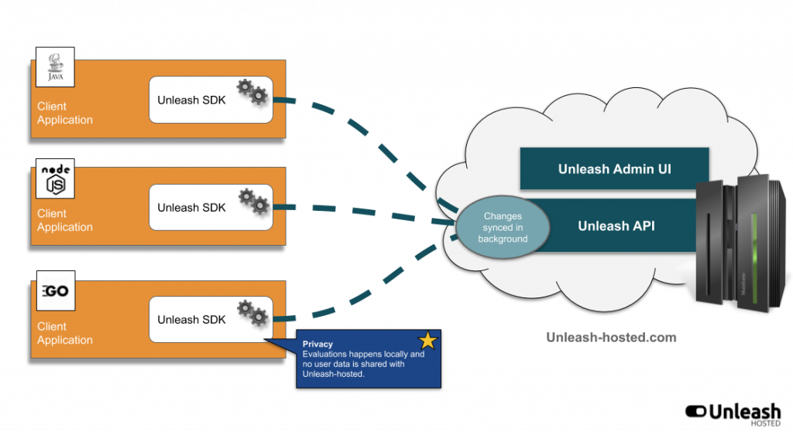

Unleash Demo
============

This is a proof of concept project using [Unleash](https://github.com/Unleash/unleash)
feature flag & toggle system.

In this simple [Spring Boot](https://spring.io/projects/spring-boot)
application there are showcased a few feature toggling scenarios:

- showing a modern version of the web page header
- showing the quote of the day only to specific users
- displaying a special greeting only on specific devices (e.g. : Desktop/Mobile/Tablet)
  
In a simple form a feature toggle works in the following fashion:

```
   if (modern page header is enabled){
      // render modern page header
      // ...
   }else{
      // render classic page header
      // ...
   }
``` 

Ideally, the process of enabling or disabling a new feature in production
should happen without any code changes or redeployments.

As pointed out in the [Unleash](https://github.com/Unleash/unleash) project page:

> Feature toggles decouple deployment of code from release of new features

Through the usage of feature toggling framework, new functionalities can be released to
production with the possibility of enabling/disabling them at a later point of
time through an admin UI outside of the running web application.

When thinking first about feature toggles, it would be enough to 
simply turn on / off a certain feature.
This kind of functionality could be implemented by the usage 
of [Spring Cloud Config Server](https://cloud.spring.io/spring-cloud-config/multi/multi__spring_cloud_config_server.html).
The system administrator could simply do a `git commit` to toggle a certain feature flag
in the application without any code change or application restart.
On the other hand, this way of handling feature toggles has some downsides:

- it is limited to Java & Spring Boot
- it doesn't offer the possibility to enable the feature only for a small subset of users
- enabling/disabling features over `git commit` in a configuration repository can be cumbersome 
for a non-technical product manager  

Compared to the scenario exposed above [Unleash](https://github.com/Unleash/unleash)
framework comes with a lot of functionalities to adress these shortcomings:
 
- Unleash client SDK can be embedded in any kind of application written in any popular programming language
- provides an administration web UI to manage and track the usage of the feature toggles 
- provides a set of strategies associated with the feature toggles in order to enable gradual rollout of the features.
In this way, a feature could be safely rolled out only for a subset (e.g. : specific emails, specific IPs, 
only Desktop/Mobile) of the users of the website
 
  
Common activation strategies offered by Unleash:

- Active For users with a specified userId
- GradualRollout to X-percent of our users
- Active for our beta users
- Active only for application instances running on host x.  

**NOTE** that Unleash offers the possibility to write custom strategies (e.g. : active for users with a specified device - based
on the User-Agent request header).

## Unleash Architecture




As can be seen from the picture above, the client applications are supposed to embed the Unleash client SDK
and communicate with the server for reading the feature toggles.

The Unleash server is written in Node.js.

At the time of this writing, there are Unleash client SDK implementations for Java, Node.js, Go, Ruby, Python and .NET Core.  


## Demo

Spawn the Unleash server environment by using Docker:

```
docker-compose -f docker/docker-compose.yml up
```

Go to the [Unleash Admin UI](http://localhost:4242/) and create several feature toggles:

- `blueHeader` with default on/off strategy
- `qotd` with `userWithId` strategy. Add `bob` as a user ID 
- `specialGreeting` with custom made `deviceClass` strategy. Create before the `deviceClass` strategy with the parameter `device` of type `list`.
When configuring the strategy for the `specialGreeting` feature toggle, enter `Desktop` and `Tablet` values in the preffered values for the `device` parameter.

Start the Spring Boot web application

```
./gradlew bootRun
```

By toggling on/off the `blueHeader` toggle and reloading the pages of the website (after 10 seconds since the last change),
the page header toggling should come into effect.

When being logged as `bob` and visiting the page http://localhost:8080/user/index , the user should see the quote of the day.
**NOTE** that the quote of the day will not be shown for the user alice`.

When visiting the page http://localhost:8080/user/greeting from a `Desktop` or `Tablet` device (switch between modes through Browser
Developer Console) the user will be presented with the message `We're really glad to have you here.`
**NOTE** that this message will not be shown when visiting the page from a `Mobile` device.


## Resources 

- [Unleash project @Github](https://github.com/Unleash/unleash)
- [Finn Blog post for Unleash](https://schibsted.com/blog/unleash-features-gradually/)
- [Unleash Blog](https://medium.com/unleash-hosted)
- [Togglz - Feature Flags for Java Platform](https://www.togglz.org/)
